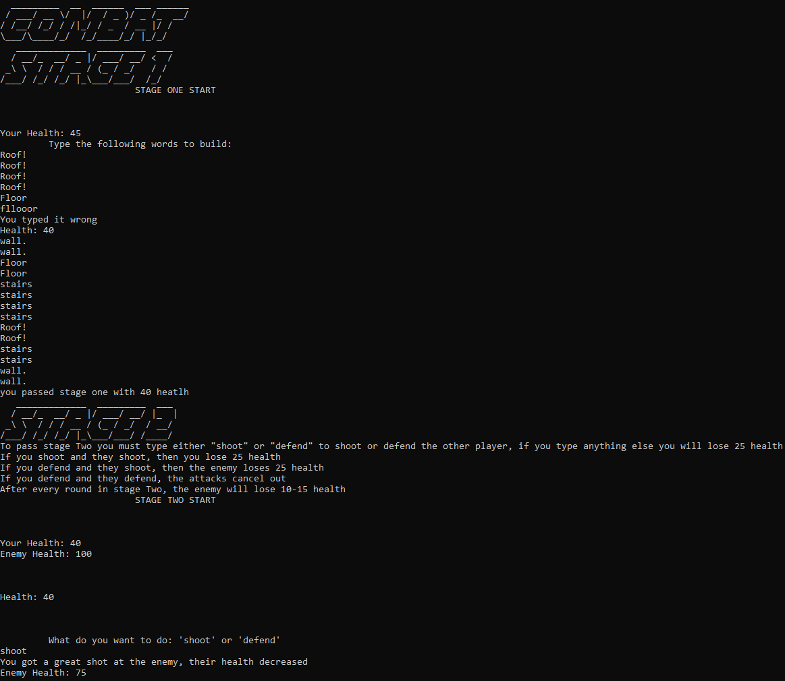
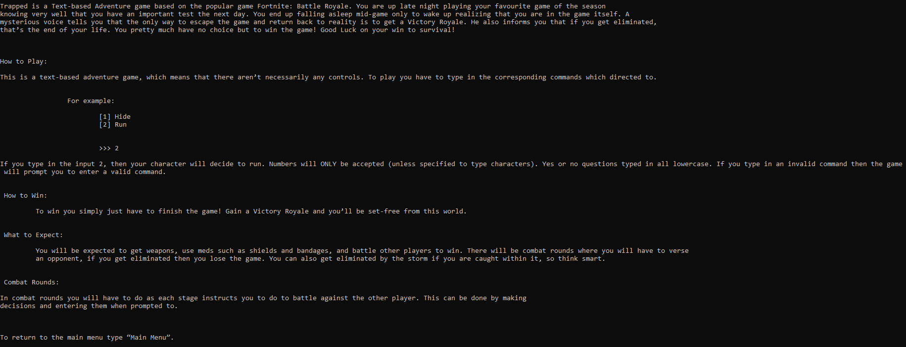
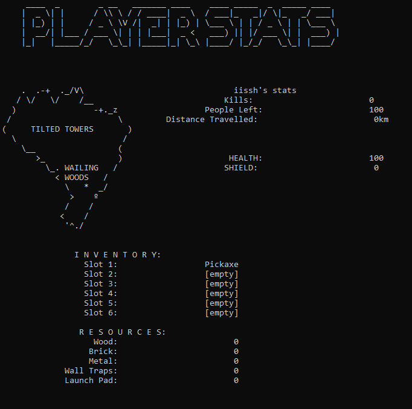
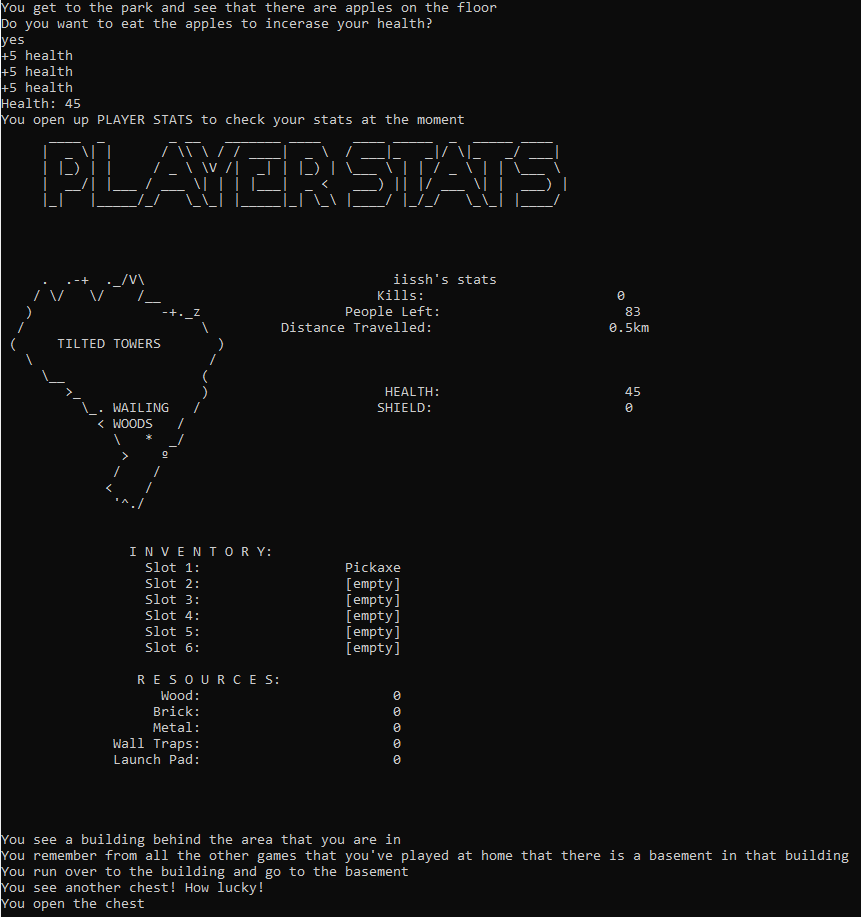
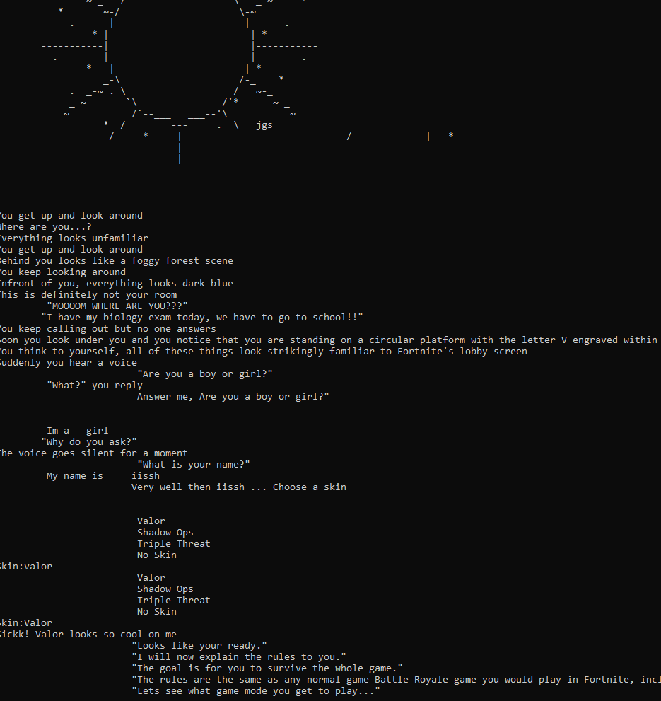

# Trapped
A text-based adventure game based of the popular Battle Royale game Fortnite.

To run the game just download the `Trapped.py` file and open it up!

## How to Play
### Make Choices
Choose where you want to land. Do you want to land at the aggressive Tilted Towers? Maybe you would like a little more time to loot up so you would rather Wailing Woods? Choices affect the way the game will turn out so choose carefully. You will be prompted to enter a number for a specific choice selection or you will be prompted to enter custom words. Read the options carefully before choosing. Additionally, "yes" and "no" should be typed in lower case letters.

### Play Mini Games
There are tons of mini-games throughout your adventure. Follow the rules carefully and do as you are told. If luck is on your side you might be the winner!

  

### Detailed Instructions
Below are the official instructions from the game.

  

## Notable Features
### Player Stats
Your progress, health and shield bars, weapons and resources collected will all be located in your player stats section. This updates frequently during the game so don't worry if you aren't sure where you are at.

    

### Customization
Customize your avatar. Choose a female or male avatar, a custom name, and a costume of your choice.

  

